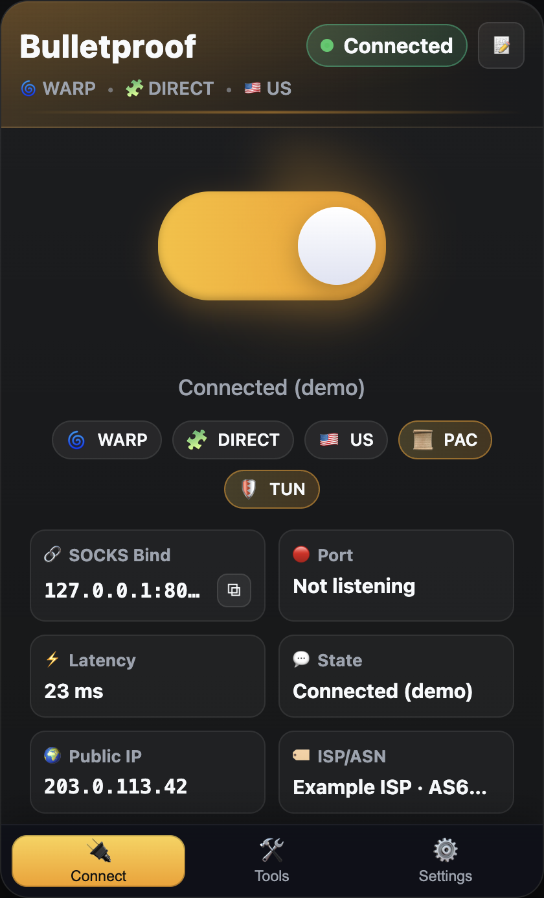
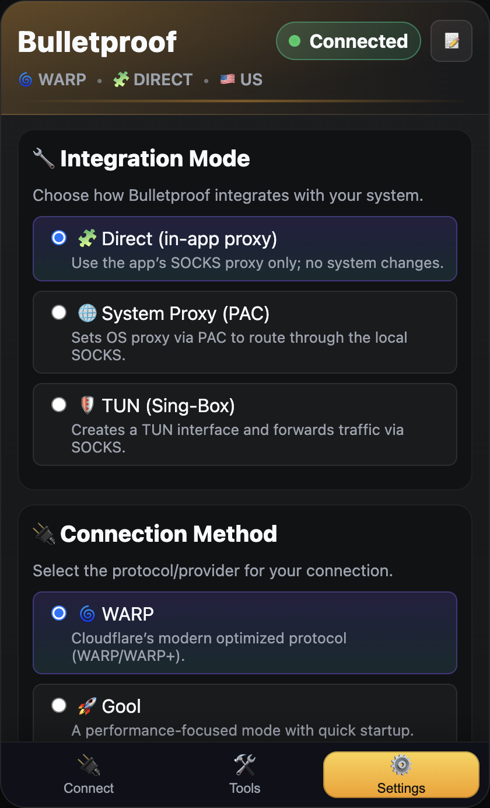
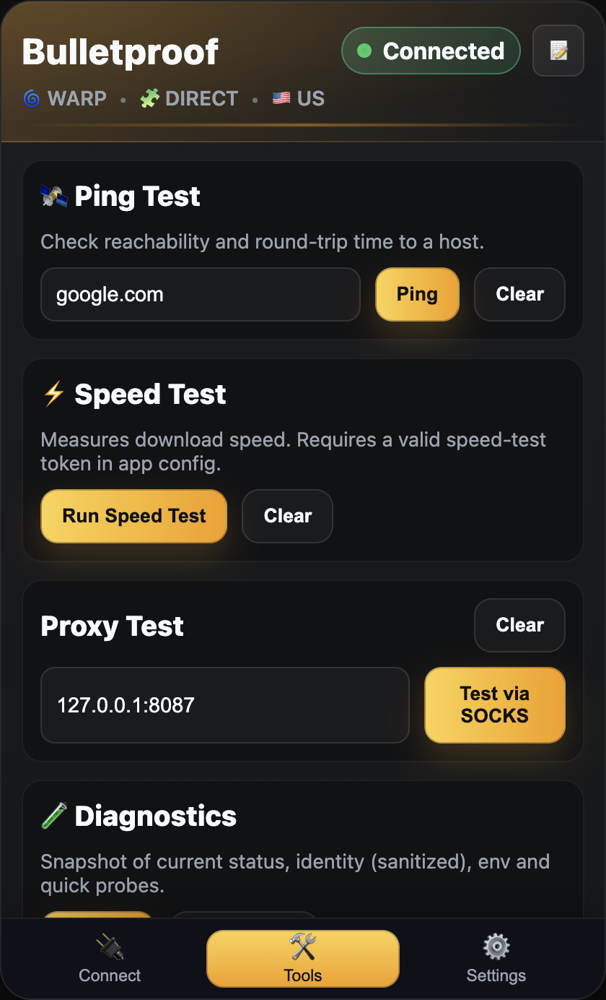

# Bulletproof — Cross‑Platform Desktop VPN Client


[](https://www.electronjs.org/)
[](https://nodejs.org/)
[](https://go.dev/)
[](#)
[](#license)

Bulletproof is a cross‑platform desktop VPN client with an Electron (TypeScript/React) UI and a Go backend that drives a custom WireGuard/WARP engine. It provides secure, encrypted connectivity via three provider modes (WARP/WARP+, Gool, Psiphon) and three integration options (Direct proxy, system‑wide PAC, or TUN via Sing‑Box).

The app window is fixed size with a large on/off toggle (grey when off, bright when on), concise status text, and a gear icon that opens Settings. It also includes built‑in utilities for network scan, ping, speed test, plus a tray menu with minimize‑to‑tray and auto‑start.

- Providers: `warp`, `gool`, `psiphon`
- Integration: `direct` (no system changes), `pac` (system‑wide proxy via PAC), `tun` (system TUN via Sing‑Box)
- Backend API bind: `127.0.0.1:4765`


## Features

- WARP/WARP+ with optional license upgrade, plus Gool and Psiphon modes
- Three integration modes: Direct SOCKS5, system‑wide PAC, or TUN interface
- Status feedback: identity, connection state, active bind, PAC/TUN state
- Utilities: endpoint scan (via engine), ping, speed test (token required)
- Cross‑platform packaging via Electron Forge; Windows Squirrel updater
- Tray support: minimize to tray, show app, start on boot, quick quit


## Architecture

- Frontend: Electron + React/TypeScript
  - Main process spawns the backend and exposes IPC for: connect, disconnect, status, diagnostics, ping, proxy test, etc.
  - Renderer provides the UI (toggle, status, Settings, Tools).
- Backend: Go HTTP daemon (`bulletproofd`)
  - Orchestrates provider engines using bundled helpers: `warp-plus` for WARP/Gool/Psiphon, optional Sing‑Box for TUN.
  - Exposes a localhost HTTP API for the UI and for CLI users.
- Helpers: distributed under `frontend/resources/bin/<platform>-<arch>/`
  - `warp-plus(.exe)` — establishes the encrypted tunnel and exposes local SOCKS5 (canonically `127.0.0.1:8086`).
  - `sing-box(.exe)` or `sb-helper(.exe)` — sets up a TUN device that forwards into the local SOCKS proxy.

How it works at a glance:

1) Ensure WARP identity (create/register on first connect; reuse afterward).
2) Start the provider engine (`warp-plus`) which exposes a local SOCKS5.
3) Apply the chosen integration:
   - Direct: do nothing — apps can use the local SOCKS5.
   - PAC: set system‑wide Proxy Auto‑Config so apps use the SOCKS5.
   - TUN: run Sing‑Box to create a TUN that routes traffic into SOCKS5.
4) Report status and keep lightweight supervision of helper processes.


## Repository Layout

- `backend/` — Go 1.22 service `bulletproofd`
  - Entry: `backend/cmd/bulletproofd/main.go`
  - HTTP API: `backend/internal/api/server.go`
  - Core manager/state: `backend/internal/core/*`
  - Default state dir: `./state` (relative to backend)
- `frontend/` — Electron + React + TypeScript
  - Main: `frontend/src/main.ts`
  - Renderer: `frontend/src/renderer.tsx`, `frontend/src/App.tsx`
  - Preload: `frontend/src/preload.ts`
  - Helper binaries: `frontend/resources/bin/<platform>-<arch>/`
  - Dev state: `frontend/state/`
- Root: `.env` (optional), `README_BACKEND.md` (backend specifics)


## Quick Start (Development)

Prereqs: Go 1.22+, Node 18+ (Electron 30), a recent npm.

1) Build backend

```bash
cd backend
go mod tidy
go build -o bulletproofd ./cmd/bulletproofd
```

2) Install frontend deps and start Electron (spawns backend automatically)

```bash
cd ../frontend
npm ci
npm start
```

Notes:

- The Electron main process will try to spawn `../backend/bulletproofd`. Override with `BACKEND_BIN=/custom/path/bulletproofd npm start`.
- On macOS, bundled helpers may be quarantined. The app attempts to remove `com.apple.quarantine` and `chmod +x` automatically.


## Building & Packaging

- Backend only:

```bash
cd backend && go build -o bulletproofd ./cmd/bulletproofd
./backend/bulletproofd -addr 127.0.0.1:4765 -state ./state
```

- Frontend dev:

```bash
cd frontend && npm ci
npm start
```

- Package desktop app (Electron Forge):

```bash
cd frontend && npm run make
```

Binaries for helpers must be present under `frontend/resources/bin/<platform>-<arch>/` so they are included in the packaged app.

Icon setup:

- Base logo: `frontend/src/assets/icon.png` (square; 1024×1024 recommended)
- Generate platform icons before packaging:

```bash
cd frontend
npm ci  # installs icon-gen
npm run build:icons  # writes icon.icns and icon.ico next to icon.png
```

Electron Forge is configured to use `src/assets/icon` as the base icon; it will pick `.icns` on macOS and `.ico` on Windows. The PNG is also bundled and used for tray/dev.


## Configuration

- Backend address: fixed to `127.0.0.1:4765`.
- State directories:
  - Backend: `backend/state` (identity, logs, generated config)
  - Frontend (dev UI state): `frontend/state`
- Environment variables:
  - `BACKEND_BIN` — explicit path to `bulletproofd` that Electron should spawn during development.
  - `WARPPLUS_BIN` — path to `warp-plus(.exe)`; auto‑detected from `resources/bin` when packaged.
  - `SINGBOX_BIN` — path to `sing-box(.exe)` or `sb-helper(.exe)`; auto‑detected from `resources/bin` when packaged.
  - `WARPPLUS_IPV4` / `WARPPLUS_IPV6` — set to `1` to prefer only that IP family.
  - `WARPPLUS_VERBOSE` — set to `1` for more verbose engine logs.
  - `WARPPLUS_TEST_URL` / `WARPPLUS_TEST_URLS` — connectivity probe URL(s) used by the engine.
  - Speed test: the renderer’s speed test requires a token for `fast-speedtest-api`. Provide via your own config; do not commit secrets.

Helper binaries layout (packaging):

```
frontend/resources/bin/
  darwin-x64/      warp-plus   sing-box
  darwin-arm64/    warp-plus   sing-box
  linux-x64/       warp-plus   sing-box
  win32-x64/       warp-plus.exe   sing-box.exe
```


## Using the App

- Toggle: click the big switch to connect/disconnect.
- Status: see connection state, active bind, and short messages (e.g., “warp warming”, “warp active”).
- Settings: choose provider (`warp`, `gool`, `psiphon`), integration (`direct`, `pac`, `tun`), server/port (if applicable), exit country, and license type (WARP+ optional key).
- Tools: ping a host, quick proxy connectivity test, and speed test.
- Tray: minimize to tray; tray menu includes “Show App”, “Start on Boot”, and “Quit”.


## Screenshots

Place screenshots in `docs/` (paths below are placeholders):






## HTTP API (Backend)

Base URL: `http://127.0.0.1:4765`

- `GET /v1/health` → `ok`
- `GET /v1/status` → current status JSON
- `POST /v1/connect` body:

```json
{
  "provider": "warp|gool|psiphon",
  "exitCountry": "US",
  "server": "optional endpoint",
  "port": 0,
  "options": {
    "integration": "direct|pac|tun",
    "key": "<optional WARP+ license>",
    "bind": "127.0.0.1:8087" // public SOCKS bind (backend may override/persist)
  }
}
```

- `POST /v1/disconnect`
- `GET /v1/identity` — show identity presence and metadata
- `POST /v1/identity/reset` — reset identity (next connect will re‑register)
- `GET /v1/scan` — list candidate endpoints (via engine `--scan`)
- `GET /v1/proxy/enable` / `GET /v1/proxy/disable` — enable/disable system PAC (macOS implemented)
- `GET /proxy.pac` — generated PAC file pointing at local SOCKS
- `GET /v1/test/socks?bind=127.0.0.1:8086` — simple HTTP fetch via local SOCKS for diagnostics
- `GET /v1/diag` — snapshot with status, env, paths, and quick TCP probes

Notes:

- The engine’s canonical internal SOCKS bind is `127.0.0.1:8086`. A shim may provide a separate public bind to avoid collisions and provide direct fallback while the tunnel warms.


## Development Notes

- Go style: `go fmt`; lowercase packages; exported APIs in PascalCase; keep state in `core.Manager`; return errors and log at edges.
- TypeScript/React style: 2‑space indent; strict TS; components in PascalCase; keep components small.
- Linting: `npx eslint 'src/**/*.{ts,tsx}'` (configure as needed).
- Tests:
  - Go: place `*_test.go` next to sources; run `cd backend && go test ./...`.
  - Frontend: no runner configured (recommend Vitest/Jest + Testing Library if added later).


## Security & Privacy

- Do not commit secrets (e.g., speed‑test tokens, license keys).
- Backend binds to `127.0.0.1` only — do not expose it publicly.
- Identity and logs live under `backend/state`. Clear this directory to reset backend state. The frontend’s local UI state lives under `frontend/state`.


## Troubleshooting

- Backend not found when running `npm start`:
  - Build it first (`go build`) or set `BACKEND_BIN=/path/to/bulletproofd npm start`.
- Helpers not executable (macOS/Linux):
  - The app tries to `chmod +x` and remove quarantine; if needed run `chmod +x` and `xattr -d com.apple.quarantine` manually.
- No connection / port not listening:
  - Check `backend/state/warp-plus.log` and `GET /v1/diag`.
  - Ensure `warp-plus` exists under `frontend/resources/bin/<platform>-<arch>/`.
  - Try forcing IPv4 with `WARPPLUS_IPV4=1`.
- Speed test fails:
  - Provide a valid token via your local config and restart; the shipped code uses `fast-speedtest-api` and requires a token.
- PAC/TUN issues:
  - PAC is implemented for macOS. TUN requires appropriate privileges and a working Sing‑Box binary.


## Contributing

- Use Conventional Commits (e.g., `feat: add psiphon provider`, `fix: handle connect error`).
- Open PRs with a clear description, repro/verify steps, screenshots for UI changes, and call out any backend API changes. Ensure the backend builds and `npm start` works.


## License

This repository currently does not include a license file. If you intend to open‑source it, add a `LICENSE` (e.g., MIT or Apache‑2.0) and update the badge above. For proprietary/internal distribution, keep it unlicensed or include an appropriate EULA for distributed binaries.


---

For backend‑only details, see `README_BACKEND.md`.
